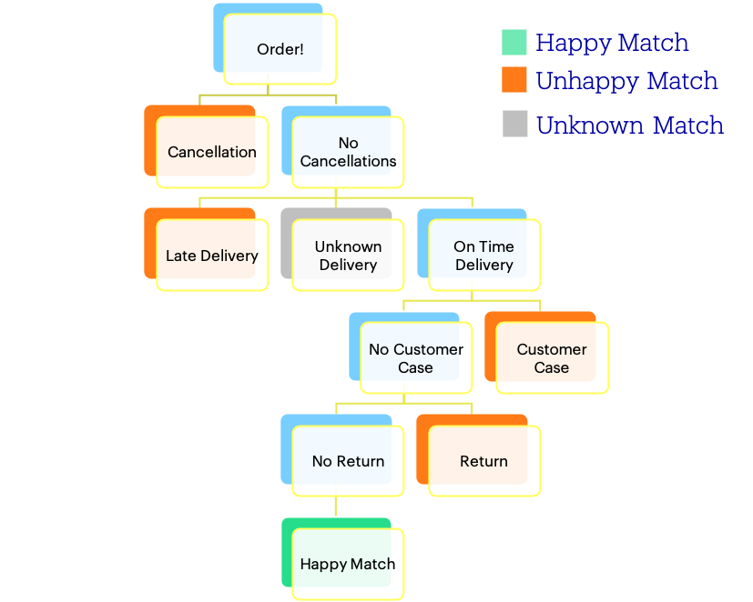

# Happy Matches Business Case - Bol.com
## About the Happy Matches algorithm
This case is about Happy Matches: a designed business metric that classifies orders. An order is classified as a Happy Match when it meets all of our service criteria (not cancelled, on time delivered, no return and no customer case). 

For reproducibility reasons, we finalize the matches 30 days after the order date. Then, the match is final. We take 30 days because of the return period. But, we do have different lookbacks for the different service criteria:
- Cancellations: we look back a maximal of 10 days
- Fulfilment: we look back a maximal of 13 days
- Cases: we look back a maximal of 30 days
- Returns: we look back a maximal of 30 days

In practice this means that when a customer calls half a year later about an order, we do not take this into account for the classification of Happy Matches.

## (Happy) Match Categorization

To make it simple: a Happy Match is a classification on an order where nothing specifically went wrong: not cancelled, on time delivered, no return and no customer case.

If one of these aspects did not met our criteria, the match will be unhappy. Below you can see the flow an order goes trough.

We do have a more detailed classification in the unhappiness of matches. This is based on business logic were the basic is: if more goes wrong (e.g. late delivered ánd a case), more unhappyness. The levels of unhappiness are: mildly unhappy, medium unhappy and heavily unhappy. You do not have to know the exact business rules for this, also because it is a quite complex decision tree based on business rules.

## Investigation topics
30 days is quite a long period for finalizing matches. Ideally we would look at how the orders from yesterday went in terms of service performance in order to quickly spot problems. Unfortunately, we do not know a lot if we look today at data from yesterday since many orders still need to be delivered. 

Therefore, we need to create a system where we can predict earlier if the order will be happy or unhappy and ideally as soon as possible. If we know the drivers of cancellations, late/unknown deliveries, cases and returns, we can earlier tackle problems. As the Platform Quality department, we are in particular interested in partner performance drivers. Therefore, some relevant questions for us are:
- Can we create a prediction model that knows the outcome before 30 days? 
    - If you want to work on this topic, you need to think about 'how many information did we know 1 day, 2 days, etc., after the order date'. To do so, work with date differences of e.g. cancellation date to account for this.
- Can we identify product groups that have extra risk? 
    - E.g. in having many cases
- Can we see periods in time where we have to be more cautious? 
- Can we focus more on certain types of partners on our Platform? 
    - E.g. assortment, frequency of selling, etc.
- Can we find strong relationships between certain variables?

All these questions are relevant for us. You are free to focus on what we find relevant. 
Be free in your choices and make your decisions based on the data. 

We would also encourage you to be creative in designing new features. Think for example about whether you want to take the day of the week (Monday, Tuesday, etc.) into account or if you want to account for Holidays, or previous performance.

## Data Description
We included a sample of the Happy Match data in the folder 'data'. The data is sampled for some retailers and includes almost 2 years of order data, separated per csv. The columns of the two csv's are exactly the same.
For the sampling we randomly selected X of our partners and from them you will see all order data of both years (if available). 

##### Confidentiality 
Once again, note that the data we share is confidential and the data nor the insights should not be shared without our permission. We did not anonymize that much in the data so that you have a good feeling about which kind of data we use.

However, we do want to encourage you to deliver the best possible analyses and/or model. Therefore, we are ok if you want to write a paper about this topic. If so, do not include the data (also not a sample of the data) and do not mention bol.com's name but use a derivation such as 'a retailer in the Netherlands'. 

##### The sample contains the following data:

| Column name   		 		| Description   |
| ------------- 				| ------------- |
| orderDate  					| Order date |
| productId  					| Product identifier |
| sellerId  					| Partner identifier |
| totalPrice  					| Product price times quantity ordered |
| quantityOrdered  				| Quantity Ordered from that product |
| countryCode  					| Country of customer |
| cancellationDate  				| If available, cancellation date |
| cancellationCode  				| Internal cancellation logging code |
| promisedDeliveryDate  			| The day the customer should receive the package |
| shipmentDate  				| Date when the partner confirmed the shipment. Note that partners can also confirm the shipment after package was sent. If we do not know the shipment date, delivery will be unknown and so will the column onTimeDelivery be null  |
| transporterCode               		| Transporter code |
| transporterName               		| Transporter name |
| transporterNameOther          		| Transporter name other |
| dateTimeFirstDeliveryMoment			| The datetime the carrier delivered the package (either to customers home, parcel point or neighbor). If this variable <= promisedDeliveryDate then we consider the delivery as on time. This datetime is based on the delivery scan of the transporters |
| fulfilmentType  				| FBB means Fulfilment By Bol.com By Bol.com (Bol.com takes care of storage & shipment). See https://www.bol.com/nl/m/logistiek/ for more information. FBR means Fulfilment By Retailer, which means partners take care of storage and shipment themselves |
| startDateCase  				| If available, date when customer case was made |
| cntDistinctCaseIds  				| Amount of unique cases |
| returnDateTime  				| If available, date when return was registered |
| quantityReturn  				| Quantity that was returned |
| returnCode  					| Internal return logging code |
| productTitle  				| Product title |
| brickName       				| Brick name. Some kind of product classification |
| chunkName       				| Chunk name. Some kind of product classification |
| productGroup  				| Product group |
| productSubGroup  				| Product sub group |
| productSubSubGroup  				| Product sub sub group |
| registrationDateSeller  			| Date when the partner was registered at bol.com |
| countryOfOriginSeller         		| Country of origin from partner |
| currentCountryAvailability    		| Current country/countries the partner ships to. NL, BE or ALL (= NL + BE) |
| calculationDefinitive  			| Boolean whether 30 days after the order date have passed |

The columns below rely on the look back periods mentioned on top of this file and these columns can be used for supervised prediction. Note that noCancellation, onTimeDelivery, noCase, hasOneCase, hasMoreCases & noReturn all contribute to the final match classification (generalMatchClassification and detailedMatchClassification). Therefore, you should not include one of the columns below as predicting feature(s).

| Column name   		 		| Description   |
| ------------- 				| ------------- |
| noCancellation  			    	| Boolean whether there was a cancellation within 10 days after the order date that we want to take into account |
| onTimeDelivery  				| True, False or null. If False, the order was classified late within 13 days, if True the order was classified on time within 13 days and if null the order was classified as unknown within 13 days in terms of delivery |
| noCase  					| Boolean whether there was a case within 30 days after the order date that we want to take into account |
| hasOneCase  					| Boolean whether there was one case within 30 days after the order date that we want to take into account |
| hasMoreCases  				| Boolean whether there were more cases within 30 days after the order date that we want to take into account |
| noReturn  					| Boolean whether there was a return within 30 days after the order date that we want to take into account |
| generalMatchClassification  			| General Happy Match classification based on decision rules that can be HAPPY, UNHAPPY or UNKNOWN  |
| detailedMatchClassification  			| Detailed Happy Match classification based on decision rules that can be HAPPY, MILDLY UNHAPPY, MEDIUM UNHAPPY, HEAVILY UNHAPPY and UNKNOWN |

Good luck and we are looking forward to you conclusions!

